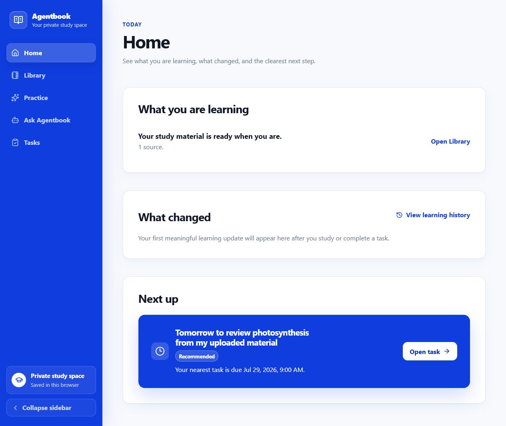
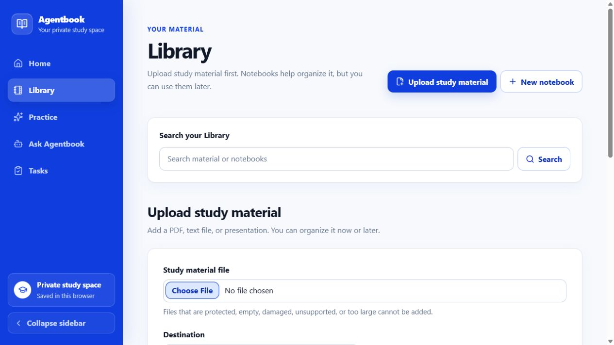
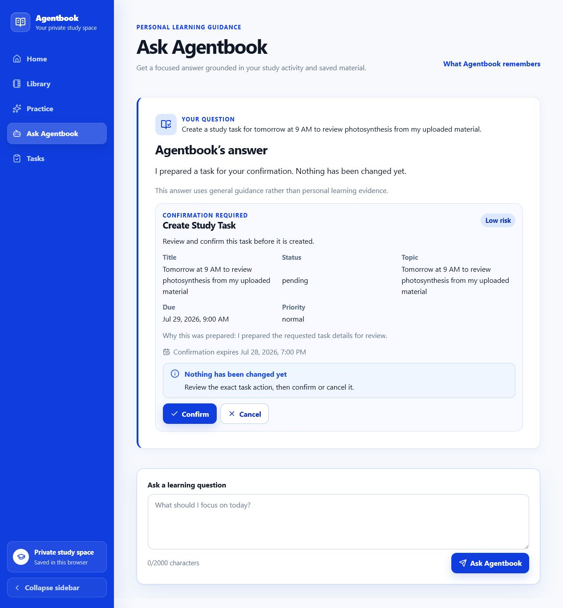
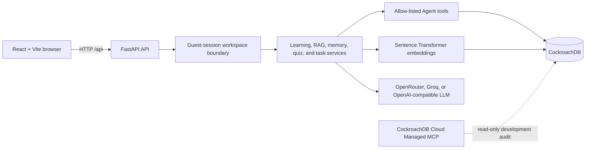

# Agentbook

**An adaptive AI learning notebook that turns study material, quiz mistakes, and persistent learner context into grounded guidance and confirmed study actions.**

<p align="center">
  <kbd>React 19</kbd>
  <kbd>FastAPI</kbd>
  <kbd>CockroachDB</kbd>
  <kbd>Vector search</kbd>
  <kbd>Python</kbd>
  <kbd>TypeScript</kbd>
</p>

<p align="center">
  <a href="#architecture">Architecture</a> |
  <a href="#local-setup">Local setup</a> |
  <a href="#testing">Testing</a> |
  <a href="https://github.com/thamkaile/Agentbook">Repository</a> |
  <a href="#license">License</a>
</p>

> **Submission status:** this repository does not currently publish a live demo, demo video, or Devpost page. The application is verified for local use.



## Why Agentbook

Study tools usually treat every session as a blank slate. Notes live in one place, quiz results in another, and a generic chatbot cannot reliably explain what a learner should do next - or why.

Agentbook closes that loop. It ingests a learner's own material, retrieves source-grounded context, records quiz outcomes and learning signals, maintains reviewable learner memory, and turns that evidence into a focused next step. When the Learning Agent proposes a change, such as creating or completing a Study Task, the learner sees the exact action and must confirm it first.

This is more than a chat wrapper: the useful intelligence comes from durable, workspace-scoped learning history and source lineage, not from a prompt alone.

## What it does

Agentbook presents five primary destinations:

- **Home** - summarizes current material, meaningful learning changes, and the nearest recommended task.
- **Library** - uploads `.pdf`, `.pptx`, and `.txt` material, keeps unfiled sources in **Unsorted**, and optionally organizes them into notebooks.
- **Practice** - creates scoped reviews and quizzes, records outcomes, and feeds weakness and memory signals back into later guidance.
- **Ask Agentbook** - answers from approved learning evidence, including weak topics, recent mistakes, matching material, and the current study plan.
- **Tasks** - manages persisted Study Tasks through pending, completed, cancelled, and archived states.

Supporting views expose source-grounded chat, progress history, learner memory, document/topic detail, and system integrity checks without crowding the main navigation.

| Library: material first, notebooks optional | Ask Agentbook: writes require confirmation |
| --- | --- |
|  |  |

## The agentic learning loop

1. **Observe** - read only the current guest workspace's bounded learning evidence.
2. **Reason** - select up to four allow-listed tools and produce a concise answer or proposed Study Task action.
3. **Act safely** - return a proposal preview; no task is changed yet.
4. **Confirm** - execute only after an explicit learner confirmation.
5. **Persist and adapt** - save the task or learning outcome so later plans can use the new state.

The runtime Learning Agent can call exactly four read tools:

- `get_weak_topics`
- `get_recent_mistakes`
- `search_study_materials`
- `get_current_study_plan`

Its only write actions are `create_study_task` and `complete_study_task`. Proposals are workspace-scoped, expiring, validated again at confirmation time, and single-use. The Agent cannot run arbitrary SQL, accept a client-supplied workspace identity, bypass confirmation, or access another workspace.

## How CockroachDB is used

With `PERSISTENCE_BACKEND=cockroach`, CockroachDB is Agentbook's runtime system of record for workspaces, source metadata and chunks, notebooks, quizzes, learning signals, learner memories, study history, workflows, and Study Tasks.

Two workspace-prefixed cosine vector indexes provide distributed vector retrieval:

- `idx_document_chunks_workspace_embedding` searches document material for grounded answers and practice.
- `idx_memory_embeddings_workspace_embedding` retrieves relevant learner memory for personalization.

Both indexes use 384-dimensional embeddings. Relational queries and owned joins repeat the workspace boundary, and vector results are checked against workspace-scoped records. CockroachDB therefore combines durable learning state, source lineage, and vector retrieval in one distributed data layer.

### Managed MCP: development-time only

CockroachDB Cloud Managed MCP is **not** part of the runtime request path. During development, Codex used read-only OAuth access to inspect the live schema, run safe aggregates, and review a sanitized `EXPLAIN` plan. That audit shaped the workspace-safe `get_weak_topics` query: weakness is derived from explicit outcomes, recency, repetition, and learning signals because the live schema has no synthetic `mastery_score`.

No write MCP tool, schema mutation, guest bearer credential, database URL, private learning row, or embedding was used in that workflow. At runtime, the Learning Agent reaches CockroachDB only through controlled application services and repository tools.

## AWS status

AWS is not currently configured or used. The repository contains no AWS deployment, infrastructure-as-code, or S3 adapter, so Agentbook does not claim an AWS service or public AWS architecture. In CockroachDB mode, uploaded bytes are currently stored through the database-backed `BlobStorage` adapter. Adding object storage or deployment infrastructure is future work, not a completed capability.

## Architecture



SQLite plus separate Chroma stores remain the safe default for local compatibility and tests. The CockroachDB path is selected explicitly and uses Alembic migrations through `0004_persisted_study_tasks`.

## Security and privacy boundaries

- The browser receives an opaque guest credential; the server stores an HMAC-derived token hash and resolves the workspace from the authenticated request.
- Protected endpoints reject workspace identity supplied through query parameters or headers.
- Repository reads, joins, vector retrieval, workflow state, and writes remain bound to one workspace.
- Agent prompts and outputs are filtered for internal identifiers, credentials, SQL requests, cross-workspace requests, and confirmation-bypass attempts.
- Personalized claims must come from sanitized tool results; unavailable evidence produces an explicit fallback instead of fabricated history.
- Confirmation cards expose the proposed user-facing task, not internal IDs or database details.

This is guest-workspace isolation, not full account authentication: there are no registered accounts, roles, teams, recovery flow, or administration UI.

## Local setup

### Prerequisites

- Python 3.11 recommended (the code uses Python 3.10+ syntax)
- Node.js `^20.19.0` or `>=22.12.0`
- npm
- Network access for the first embedding-model download and provider-backed AI workflows

From the repository root in PowerShell:

```powershell
py -3.11 -m venv .venv
.\.venv\Scripts\Activate.ps1
python -m pip install --upgrade pip
python -m pip install -r requirements.txt

Copy-Item .env.example .env
python -c "import secrets; print(secrets.token_urlsafe(48))"

Set-Location frontend
npm ci
Set-Location ..
```

Put the generated value in `.env` as `GUEST_SESSION_TOKEN_PEPPER`. To use generative workflows, also set a supported `LLM_PROVIDER`, `LLM_API_KEY`, and exact `LLM_MODEL`. Never commit `.env`.

Start the API:

```powershell
.\.venv\Scripts\Activate.ps1
uvicorn backend.api.app:app --reload
```

In a second terminal, start the frontend:

```powershell
Set-Location frontend
npm run dev
```

Open `http://127.0.0.1:5173`. Vite proxies `/api` to the local API on port `8000`.

<details>
<summary>CockroachDB runtime configuration</summary>

Set these values in `.env`, then apply the current schema:

```dotenv
PERSISTENCE_BACKEND=cockroach
DATABASE_URL=your-cockroach-connection-url
EMBEDDING_DIMENSION=384
ENABLE_VECTOR_INDEX=true
```

```powershell
.\.venv\Scripts\python.exe -m alembic upgrade head
```

Keep the connection URL private. The default `.env.example` uses SQLite so a local evaluator can start without a CockroachDB credential.

</details>

## Testing

Backend tests run against the SQLite compatibility backend and keep opt-in live CockroachDB checks disabled:

```powershell
$env:PERSISTENCE_BACKEND="sqlite"
.\.venv\Scripts\python.exe -m unittest discover -s tests -p "test_*.py"
Remove-Item Env:PERSISTENCE_BACKEND
```

Verified result: **227 passed, 6 live-database tests skipped**.

Frontend tests and the production build:

```powershell
Set-Location frontend
npm test
npm run build
```

Verified result: **82 passed; production build passed**.

The suite covers API and guest isolation boundaries, workspace tampering, grounded retrieval and lineage, weak-topic ranking, Agent planning and failure containment, confirmation replay/expiry/conflict behavior, Study Task lifecycle, and the primary React flows.

## Project structure

```text
backend/api/                 FastAPI routes, schemas, auth boundary, errors
backend/application/         Use cases, dependencies, Learning Agent, tasks
backend/repositories/        SQLite and CockroachDB workspace-scoped adapters
backend/rag/                 Ingestion, retrieval, citations, notebooks
backend/memory/              Learner-memory extraction and retrieval
backend/study/               Quiz, plans, coaching, reporting, progress
alembic/versions/            CockroachDB schema and vector-index migrations
frontend/src/                React routes, typed API client, UI and tests
tests/                       Python unit, API, integration, and regression tests
```

## Current limitations

- No hosted demo, demo video, Devpost submission link, or AWS deployment is present.
- Guest workspaces do not provide account recovery or cross-device identity.
- Uploaded blobs remain in the selected database adapter; no object store is implemented.
- The default embedding model downloads on first use and can be slow on a fresh machine.
- Live CockroachDB tests are opt-in, and the audited live dataset is too small for production-scale performance conclusions.

## Team

Built by [Kai Le](https://github.com/thamkaile) and [Ethan](https://github.com/ETHAN071104).

## License

Agentbook is available under the [MIT License](LICENSE).
